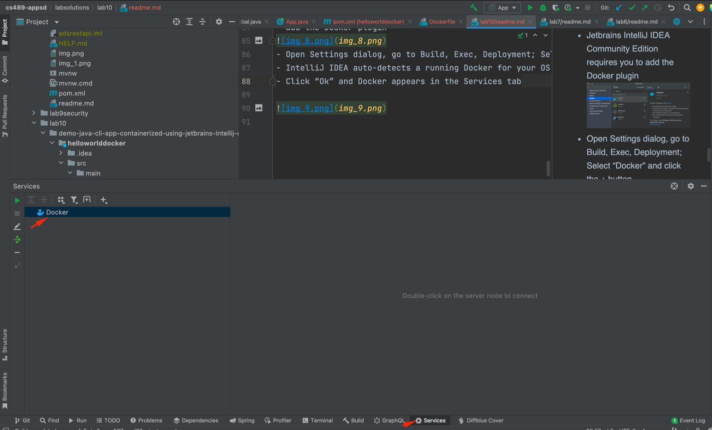

STEPS:
1. Add config in maven-jar-plugin to specify the
   mainClass
```xml
   <plugin>
   <artifactId>maven-jar-plugin</artifactId>
   <version>3.0.2</version>
   <configuration>
   <archive>
   <manifest>
   <mainClass>edu.miu.cs489.App</mainClass>
   </manifest>
   </archive>
   </configuration>
   </plugin>
```
2. Package the app by executing the maven
   command: > mvn clean package

3. Create a Dockerfile
```dockerfile
# Using OpenJDK version 17 as the base image
FROM openjdk:17
# Create a new app directory in the container for the application files
RUN mkdir /app
# Copy the compiled executable files/folders from host machine filesystem to the container/image's filesystem
COPY target/helloworlddocker-1.0-SNAPSHOT.jar /app
# Set the working directory for where next commands will execute at
WORKDIR /app
# Define the command to run the app when the contain is started
CMD ["java", "-jar", "./helloworlddocker-1.0-SNAPSHOT.jar"]
```
4. build the image
```
docker build -t helloworld-java-cli-app .
```
show all image: >docker images

5. Run the image:
```
 docker run helloworld-java-cli-app:latest
```


6. Build another docker image
```
docker build -t helloworld-java-cli-app2 .
```


7. Execute/start/run the container
   (in detached mode)
```
 docker run -d helloworld-java-cli-app2:latest
```


8. Display the container’s log
```
  docker logs ebc66de6870f
```


9. Check the status and stop the running container
- show all container
```
 docker ps
```

- stop the container
```
 docker container stop ebc66de6870f
```
-lists all running and stopped containers.
```
 docker ps --all
```

10. Operation Docker with IntelliJ
- Jetbrains IntelliJ IDEA Ultimate has the Docker plugin prebundled
- Jetbrains IntelliJ IDEA Community Edition requires you to
  add the Docker plugin

- Open Settings dialog, go to Build, Exec, Deployment; Select “Docker” and click the + button
- IntelliJ IDEA auto-detects a running Docker for your OS and connects to the docker daemon successfully

- Click “Ok” and Docker appears in the Services tab

- Select the Docker service and click the Green button to
  connect to it
- Next, expand the containers node and select a container and start/run it and view the log

- Select “MySQL” database image and click the “Pull” button.

- 
