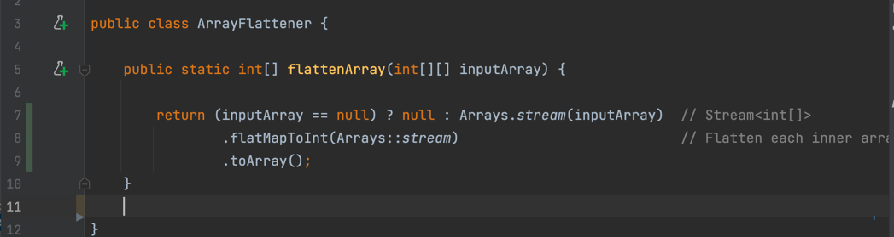
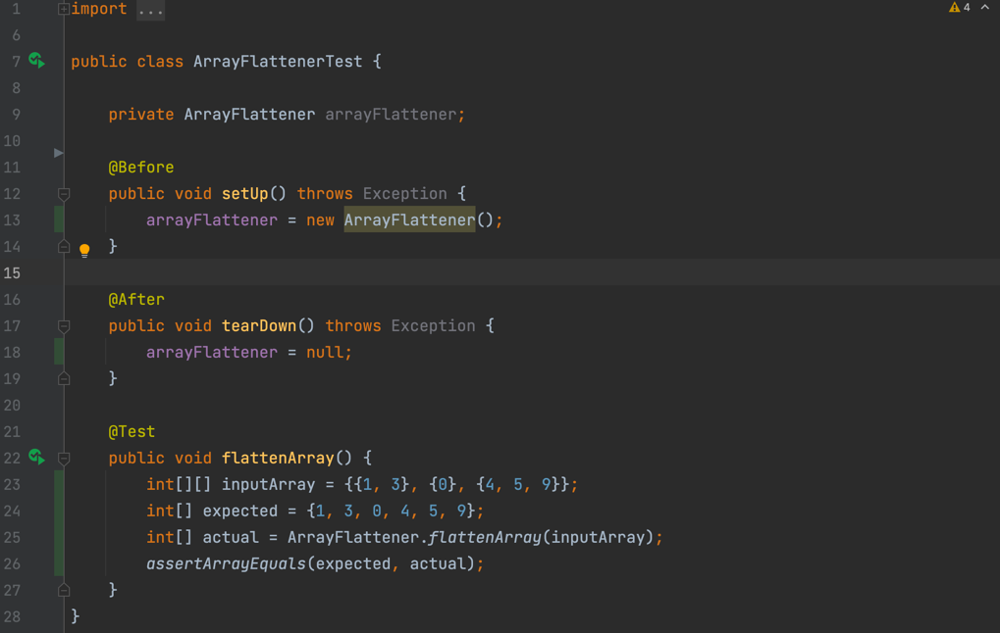
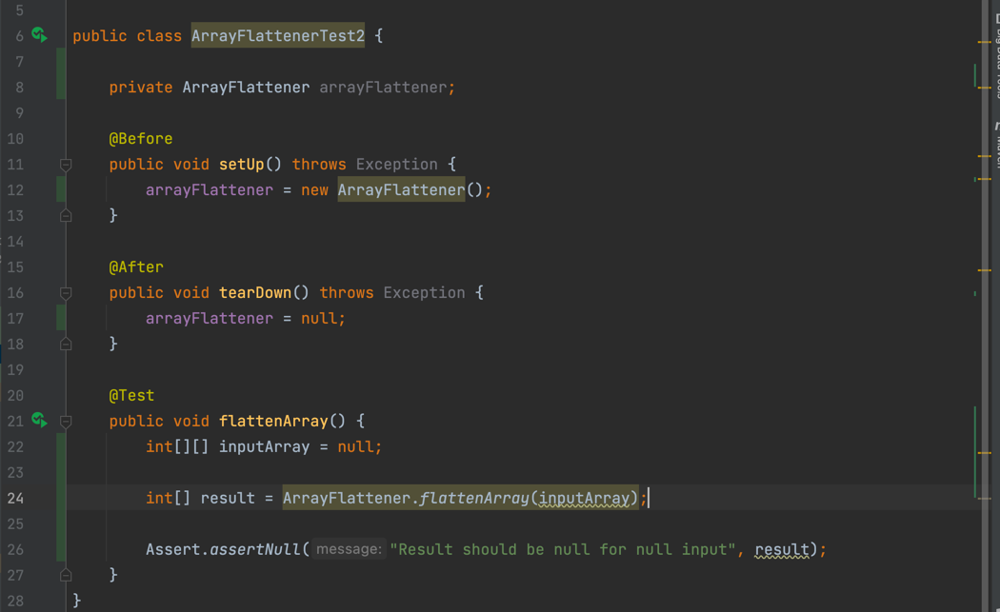
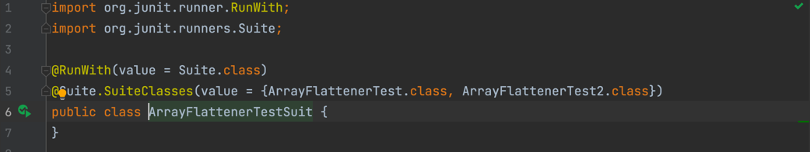
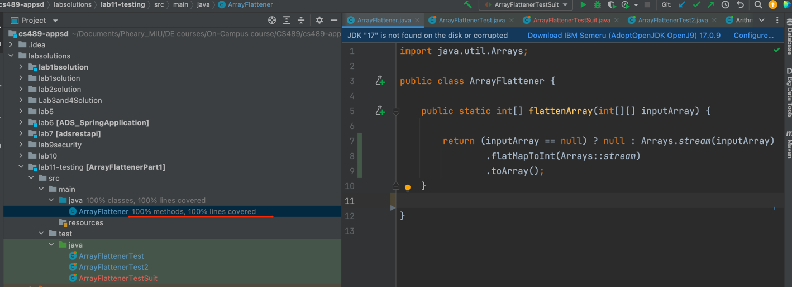
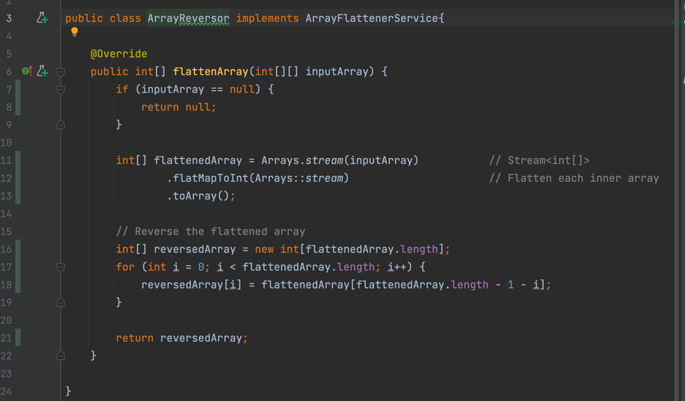

## Lab11 - Testing

## ArrayFlatener Class

## ArrayFlatenerTest1

## ArrayFlatenerTest2

## ArrayFlatener TestSuit

## Test Coverage Result

## Ex2 Result 100% Test coverage : Reverse ArrayFlatener
