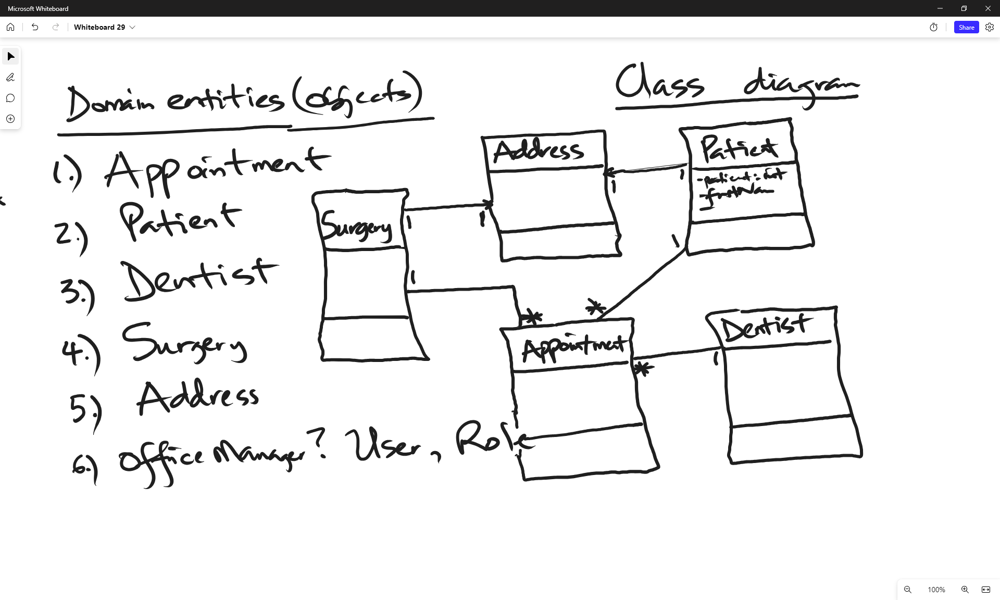
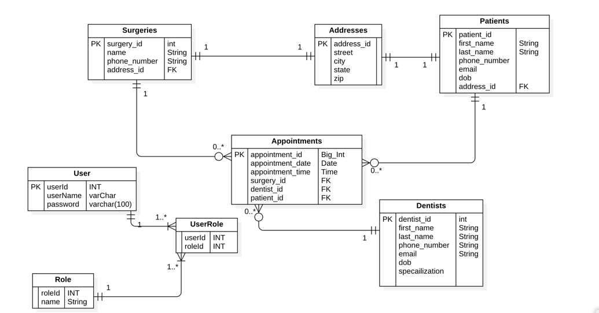

Lab6: ADS System





+ Tasks
  + Implemented the above UML class diagram in SpringBoot CLI
  + Applied top down implementation to generate table (write code first to generate table)
  + Technologies used: 
    + Java, 
    + OOP, 
    + SpringBoot framework
    + @oneToOne, @OneToMany, @ManyToMany
    + Lombok library

    ```xml
        <dependency>
            <groupId>org.projectlombok</groupId>
            <artifactId>lombok</artifactId>
            <optional>true</optional>
        </dependency>
    ```
  
    + MySQL library
    ```xml
      <dependency>
            <groupId>com.mysql</groupId>
            <artifactId>mysql-connector-j</artifactId>
            <scope>runtime</scope>
        </dependency>
    ```
    
    + Spring Data JPA

    ```xml
          <dependency>
            <groupId>org.springframework.boot</groupId>
            <artifactId>spring-boot-starter-web</artifactId>
        </dependency>
    ```
  